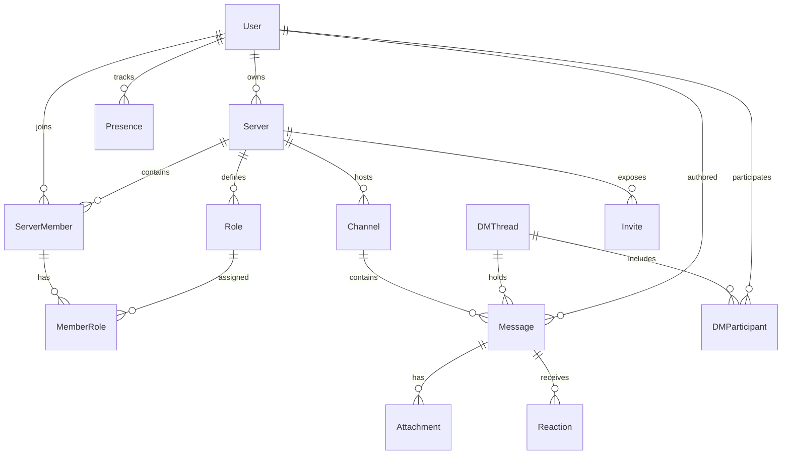

# ER Diagram Overview

```mermaid
erDiagram
  User ||--o{ Server : owns
  User ||--o{ ServerMember : joins
  Server ||--o{ ServerMember : contains
  Server ||--o{ Role : defines
  ServerMember ||--o{ MemberRole : has
  Role ||--o{ MemberRole : assigned
  Server ||--o{ Channel : hosts
  Channel ||--o{ Message : contains
  DMThread ||--o{ Message : holds
  User ||--o{ Message : authored
  Message ||--o{ Attachment : has
  Message ||--o{ Reaction : receives
  DMThread ||--o{ DMParticipant : includes
  User ||--o{ DMParticipant : participates
  Server ||--o{ Invite : exposes
  User ||--o{ Presence : tracks
```
